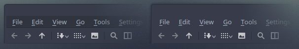

<p align="center">
  
</p>
<p align="center">
  
</p>

# About
Arc KDE - This is a port of the popular [GTK theme Arc](https://github.com/horst3180/Arc-theme) for Plasma 5 desktop with a few additions and extras.

**NOTE:** Plasma theme Arc Color now supports KDE Color Schemes with Papirus icon theme.

In this repository you'll find:
- Kvantum Themes
- Aurorae Window Decorations
- Plasma Desktop Themes
- Look & Feel Settings
- Color Schemes
- Konversation Themes
- Yakuake Skins
- Wallpapers
- Extra Tools

# Install / Update
## ROOT directory
```
wget -qO- https://raw.githubusercontent.com/PapirusDevelopmentTeam/arc-kde/master/install-arc-kde-root.sh | sh
```
## HOME directory
```
wget -qO- https://raw.githubusercontent.com/PapirusDevelopmentTeam/arc-kde/master/install-arc-kde-home.sh | sh
```

**Dependencies:**
- wget
- tar
- plasma-desktop
- [kvantum engine](https://github.com/tsujan/Kvantum/tree/master/Kvantum)
- yakuake (optional)
- konversation (optional)

# Remove
```
wget -qO- https://raw.githubusercontent.com/PapirusDevelopmentTeam/arc-kde/master/remove-arc-kde.sh | sh
```

#Official packages
| **Distro**                | **Maintainer**  | **Package** |
|:--------------------------|:----------------|:------------|
| Ubuntu-based KDE distros  | Sergei Eremenko | [arc-kde](https://launchpad.net/~papirus/+archive/ubuntu/arc-kde) (PPA) |

# Unofficial packages
Packages in this section are not part of the official repositories. If you have a trouble or a question please contact with package maintainer.

| **Distro** | **Maintainer**    | **Package** |
|:-----------|:------------------|:------------|
| Arch Linux | Marcus Behrendt   | [arc-kde-git](https://aur.archlinux.org/packages/arc-kde-git/) (AUR) |
| Arch Linux | Josip Ponjavic    | [arc-kde-git](https://build.opensuse.org/package/show/home:metakcahura/arc-kde-git) (OBS) |
| Manjaro    | Nikola Yanev      | [arc-kde](http://download.tuxfamily.org/gericom/README.html) |
| openSUSE   | Konstantin Voinov | [arc-kde](https://build.opensuse.org/package/show/home:kill_it/arc-kde) (OBS) |

**NOTE:** If you maintainer and want be in the list please create an issue or send a pull request.

# Recommendations
For better looking please use this pack with kvantum engine.

Run `kvantummanager` and choose **Arc Dark Transparent** (or another) theme and apply.

- Use with [Papirus icon theme](https://github.com/PapirusDevelopmentTeam/papirus-icon-theme) for a more consistent and beautiful experience.
- Fix the color of the menubar on Arc Dark GTK theme:

```
sudo sh ~/.local/share/plasma/desktoptheme/Arc-Dark/fix-menubar.sh
```


# Extra Themes
- [Firefox Theme](https://github.com/PapirusDevelopmentTeam/arc-kde/tree/master/extra/firefox)
- [Eclipse Theme](https://github.com/PapirusDevelopmentTeam/arc-kde/tree/master/extra/eclipse)
- [VLC Arc Dark Skin](https://github.com/varlesh/VLC-Arc-Dark)
- [Nylas Skin](https://github.com/varlesh/Nylas-Arc-Dark-Theme)

# Donate
If you like my project, you can donate at:

<span class="paypal"><a href="https://www.paypal.me/varlesh" title="Donate to this project using Paypal"></a></span>

<span class="Yandex.Money"><a href="http://yasobe.ru/na/varlesh#form_submit" title="Donate to this project using Yandex.Money"></a></span>

# License
GNU GPL v3
