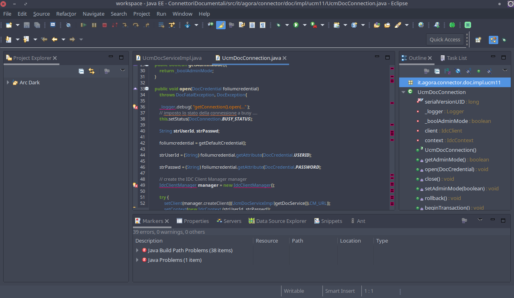

# Eclipse Arc Dark Theme for Arc Dark KDE

# Prerequisites

Install *Color IDE Pack* from **Eclipse Marketplace**  
On older versions you may need to install *Eclipse Color Theme* and *Jeeeyul's Eclipse Themes* which are now included in the pack mentioned above

# Install
## **Eclipse**

Open Eclipse preferences and browse to General > Appearance > Jeeeyul's Themes > Presets and import [*ArcDarkEclipse.epf*](ArcDarkEclipse.epf)

## **Editor**

Open Eclipse preferences and browse to General > Appearance > Color Theme and import [*ArcDarkEclipseEditor.xml*](ArcDarkEclipseEditor.xml)

Apply both and you are done!

# Notes

Both presets were tested on Eclipse neon and mars  
You shouldn't have problems on earlier versions, as far as prerequisites can be satisfied.
