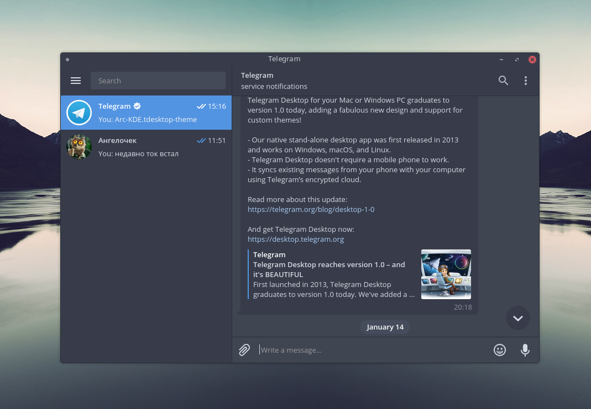
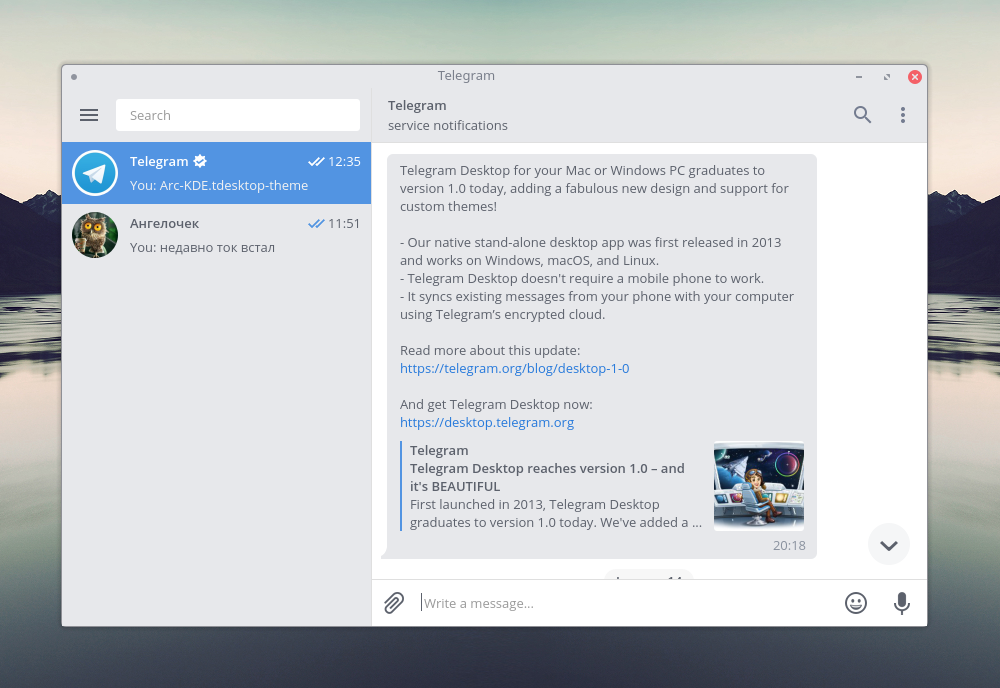

#  Telegram themes Arc & Arc Dark for KDE

Adapt telegram themes for Arc-KDE pack

Source code by [Art-2](http://art-2.deviantart.com/art/Arc-2-theme-for-Telegram-654895946)




# Dependencies

- wget
- zip
- xdg-utils

# Download and Build

## Arc Dark KDE Telegram Theme:
```
wget -qO- https://raw.githubusercontent.com/PapirusDevelopmentTeam/arc-kde/master/extra/telegram/install-arc-dark-ttheme.sh | sh

```

## Arc KDE Telegram Theme:
```
wget -qO- https://raw.githubusercontent.com/PapirusDevelopmentTeam/arc-kde/master/extra/telegram/install-arc-ttheme.sh | sh

```

# Install
Drag-n-drop **.tdesktop-theme** to Telegram


## License

Creative Commons Attribution-ShareAlike 3.0
